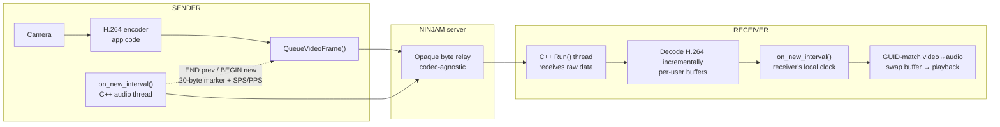
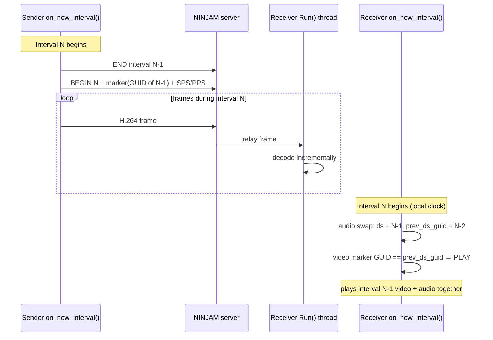
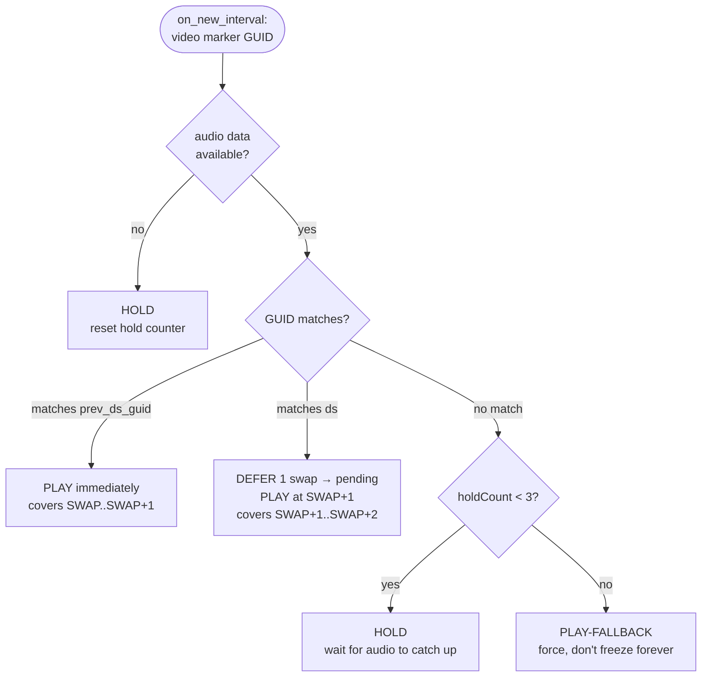

# Synchronized Video over NINJAM — Technical Overview

*How NinjamZap carries live video inside the NINJAM protocol and keeps it
aligned with audio. Written for NINJAM client developers and other engineers
familiar with the interval model.*

> **Repo scope.** The interval-sync engine described here lives in this
> repository: the C++ NINJAM core (`core/ninjamclient/libninjamcore/`) and the
> iOS bridge (`platforms/ios/NativeAudioModule/`). The camera-capture, H.264
> encode/decode, and playback-pacing layer is platform app code and is *not*
> in this repo — it is described conceptually below. End-to-end integration
> tests for the sync engine are in `tests/video-sync/`.

---

## 1. The problem

NINJAM solves real-time musical collaboration by **giving up on real-time**.
Musicians record during interval *N* and everyone hears interval *N‑1*. The
latency stops being a glitch and becomes part of the musical form.

We wanted to add live video of the players to a NINJAM session. The constraint:
**video must obey the exact same interval model as audio.** If you hear my
guitar from the previous interval, you must see me playing it in that same
previous interval — not earlier, not later. A talking head that drifts a beat
away from the audio is worse than no video at all.

The naïve approaches (WebRTC, a side channel, a separate socket) all fail the
same way: video and audio travel on different transports with different
latencies, so they drift. Our design goal was to make drift *structurally
impossible* by putting video on the **same transport, same clock, and same
interval pipeline** as the audio.

---

## 2. Key insight: the NINJAM server is codec-agnostic

Every interval upload in NINJAM is tagged with a 4-byte `fourcc` codec
identifier. Standard clients hardcode this to `OGGv` (Ogg Vorbis). But the
server never inspects it — it stores and relays interval data as **opaque
bytes**, regardless of `fourcc`.

That means a NINJAM server already is, unmodified, a generic interval-synced
data relay. We don't need a custom server. We open a second channel on the
local user, mark it as a video channel, and push H.264 through the existing
interval upload/download machinery. Third-party clients (ReaNINJAM, Jamtaba)
see the channel in the user list, try to subscribe, fail to decode a non-audio
`fourcc`, and produce silence — no crashes, full backward compatibility.

> **Server changes required: zero.** Everything described below lives in the
> client. (NinjamZap *also* runs a server fork — `ninjamzap-server` — but that
> adds per-room threading and congestion control for scale, not protocol
> changes. Video sync works against a stock NINJAM server.)

---

## 3. Architecture at a glance

```
SENDER                                              RECEIVER
───────                                             ────────
camera ──▶ H.264 encoder (app code)                 C++ Run() thread
                  │                                   receives raw data
                  ▼                                        │
        QueueVideoFrame()  ──┐                              ▼
                             │                    decode H.264 incrementally
   on_new_interval() ────────┤  NINJAM              into per-user buffers
   [C++ audio thread]        │  protocol                    │
     • END prev interval     ├──▶ server ──────────▶         ▼
     • BEGIN new interval    │  (opaque relay)     on_new_interval()
     • send 20-byte marker   │                     [receiver's local clock]
     • send cached SPS/PPS ──┘                       • GUID-match video↔audio
                                                     • swap buffer → playback
```



The two load-bearing decisions:

1. **Interval BEGIN/END are emitted from C++ `on_new_interval()`** — the *same
   thread, same instant* as the audio interval boundary. Video and audio
   intervals are literally created by the same function call.
2. **The receiver swaps video on its own local clock**, not when the sender's
   END marker arrives over the network. This mirrors how NINJAM audio already
   works and is the single most important reason the latency is low.

---

## 4. Sender side

All interval lifecycle lives in C++, on the audio thread
(`core/ninjamclient/libninjamcore/njclient.cpp`):

```cpp
// Inside on_new_interval(), before the audio interval-swap callback:
if (m_video_active) {
    if (m_video_interval_open)
        RawDataSendWrite(m_video_guid, NULL, 0, true);          // END previous
    RawDataSendBegin(m_video_guid, m_video_fourcc, m_video_chidx, 0); // BEGIN new
    m_video_interval_open = true;

    // First chunk of every interval: the 20-byte sync marker (see §6)
    // Second chunk: cached SPS/PPS so the decoder can be (re)built mid-stream
    RawDataSendWrite(m_video_guid, m_video_spspps.Get(), m_video_spspps.GetSize(), false);
}
```

The camera runs on its own capture queue (app code). Encoded frames are handed
to `QueueVideoFrame()`, which appends them to the open interval — but **only if
`m_video_interval_open` is true**. Frames that arrive between intervals are
dropped rather than misattributed.

Encoding parameters (low preset): 320×240, 10 fps, ~50 kbps H.264 baseline, no
B-frames, at least one keyframe per interval. At 10 fps an 8-second interval is
~80 frames — small enough to relay comfortably within typical NINJAM server
buffer limits. (NinjamZap's app layer also offers VGA and HD presets; the sync
engine is resolution-agnostic.)

---

## 5. Receiver side

Two threads cooperate:

**C++ `Run()` thread** receives raw data callbacks and decodes H.264
*incrementally* as bytes arrive — it does not wait for the interval's END
marker. Decoded frames accumulate in a per-user buffer.

**The receiver's own `on_new_interval()`** fires the buffer swap. At that
moment it harvests whatever frames have been decoded so far — exactly as NINJAM
audio takes whatever PCM has accumulated — and promotes them to the playback
buffer. A playback timer (app code) then paces those frames evenly across the
next interval.

Because the swap is driven by the local clock and harvests in-progress
buffers, the receiver never pays a full network round-trip of latency waiting
for an END marker.

The per-interval timing — and the 1-interval delay that makes a `prev` GUID
match the *expected* case — looks like this:



---

## 6. The sync mechanism: GUID matching

Driving video and audio off the same interval clock gets them *close*. To make
them *exact*, every video interval carries a pointer back to the audio interval
it was recorded alongside.

NINJAM already generates a fresh 16-byte GUID for each audio interval (when the
encoder writes a new interval header). We piggyback on it. The **first chunk**
of every video interval is a 20-byte sync marker:

```
Bytes 0–3   : interval counter      (big-endian uint32)
Bytes 4–19  : audio channel-0 GUID  (the GUID of the audio interval
                                     recorded at the same instant)
```

On the receiver, audio decode state already tracks two GUIDs: the currently
playing interval (`ds`) and the previously played one (`prev_ds_guid`). At each
`on_new_interval()`, the receiver compares the video marker's audio GUID
against both:



**The adaptive defer — why both `PREV` and `DS` are handled, not just one:**
NINJAM's 1-interval delay means that when the receiver swaps at interval *N*,
the audio it begins playing was recorded at *N‑1* (`ds` after swap) and the
audio just finishing in the output buffer was recorded at *N‑2*
(`prev_ds_guid`). The video marker's GUID can land on either, and the receiver
adapts:

- **`PREV` match** — the marker references the audio that was already audible
  during `[SWAP-1, SWAP]` and is finishing playback through the output buffer
  during `[SWAP, SWAP+1]`. Play video **immediately** so it covers the same
  `[SWAP, SWAP+1]` window. Aligned.
- **`DS` match** — the marker references the audio that is *in the decoder
  pipeline now* but only becomes audible during `[SWAP+1, SWAP+2]` due to the
  output buffer. Stage video into `pending` and play it on the **next** swap,
  so video covers the same `[SWAP+1, SWAP+2]` window. Aligned.

Either branch ends up perfectly synchronised — the receiver doesn't need to
care which branch fired, only that the GUID matched something. The HOLD /
FALLBACK ladder underneath absorbs transient network jitter without ever
letting video freeze permanently.

---

## 7. Wire format

```
Per video interval, on the wire (all length-prefixed, 4-byte BE length):

  [20 bytes]  sync marker        ← interval counter + audio GUID
  [SPS/PPS block]                ← [2B SPS len][SPS][2B PPS len][PPS]
  [H.264 frame 1]                ← AVCC, 4-byte NAL length prefixes
  [H.264 frame 2]
  ...
```

Channel is flagged video-only (`flags & 0x10`) so the client's audio pipeline
skips it in both `on_new_interval()` and `process_samples()`. `fourcc` is
`H264`.

---

## 8. Results

- **End-to-end video latency vs. audio: ~0.5–1 beat.** Residual delay comes
  from main-thread dispatch hops and the playback timer's first tick, not from
  the sync design itself.
- **Drift: none observed.** Because both ends run off the server's BPM/BPI and
  every interval is GUID-stamped, video cannot slowly walk away from audio.
- **Backward compatible:** standard NINJAM clients on the same server are
  unaffected — they see an undecodable channel and ignore it.
- **No server modification, no second transport, no signaling server.**

---

## 9. Things that did *not* work (and why)

These were tried and rejected — included so others don't repeat them:

| Approach | Outcome |
|----------|---------|
| Beat-sync timer in app code driving BEGIN/END | 2–3 beats late — main-thread polling detects the boundary too slowly |
| Early END (hardcoded N beats / % before boundary) | Fragile; breaks at different BPM/BPI |
| Receiver plays only when the network END marker arrives | ~10 beats — pays a full interval of network latency |
| Synchronous H.264 decode on the C++ `Run()` thread | ~10 beats — blocks network I/O, data piles up |
| Tracking intervals with a sequence counter instead of GUIDs | False positives during bursts (e.g. after a video on/off toggle) |
| Recreating the decoder every interval | Visible stutter from 15×/sec session churn |

The throughline: **anything that introduces a second clock, a second
transport, or a network-dependent trigger reintroduces drift or latency.** The
working design keeps video on exactly the rails NINJAM already built for audio.

---

## Source map

| Component | Location |
|-----------|----------|
| Interval management, video GUID sync, `on_new_interval()` video block | `core/ninjamclient/libninjamcore/njclient.cpp` / `.h` |
| Adapter passthrough (`setVideoChannel`, `queueVideoFrame`, …) | `core/ninjamclient/libninjamcore/abNinjam/ninjamclientAdapter.cpp` / `.h` |
| iOS C bridge | `platforms/ios/NativeAudioModule/NinjamClientBridge.cpp` / `.h` |
| Camera capture, H.264 encode/decode, playback pacing | Platform app code — *not in this repo* |
| End-to-end sync tests (26 Catch2 scenarios, Docker NINJAM server) | `tests/video-sync/` |

*This repository is GPL v3.*
